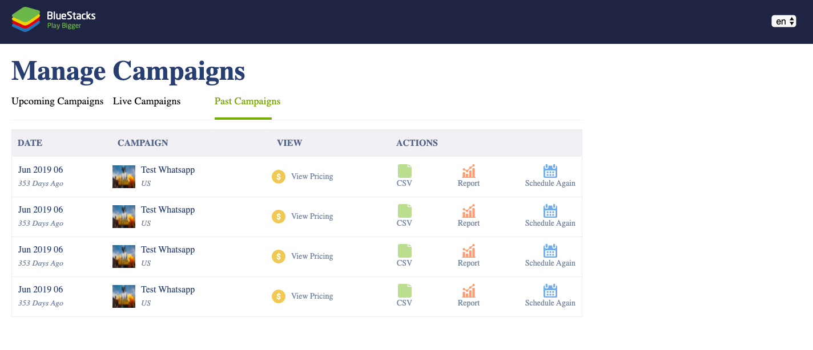
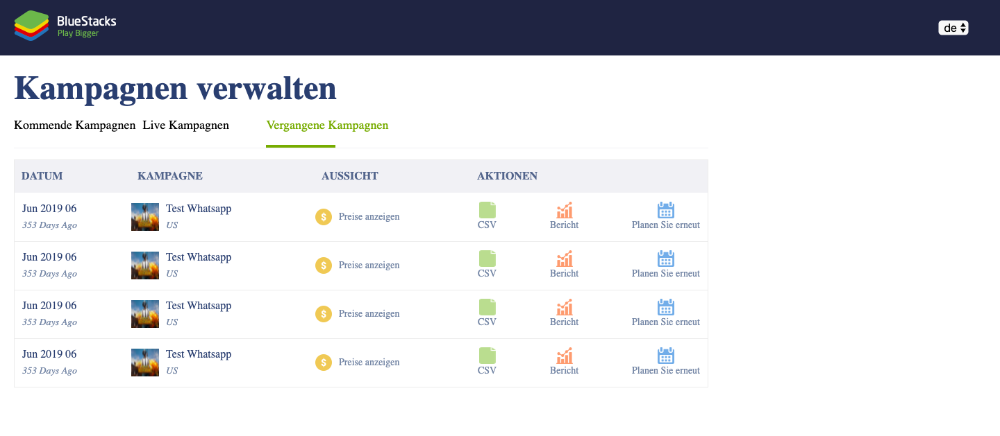

# About
> Basic Games List React App.

## Feature's
- Support basic localization of strings in 2 languages.
- Each tab shows relevant data 
- The very first column should shows the time diff from today to that campaign's date
- shows the number of days in the future or past For example, 23 days ahead
- on click of View Pricing shows a modal
- Entire UI should be responsive

## Created React App using Below boilerplate 
- https://github.com/react-boilerplate/react-boilerplate

## Deployed on github using below article
- https://dev.to/yuribenjamin/how-to-deploy-react-app-in-github-pages-2a1f

## Prerequisite
- Node 
- react 

## Step to run the project
- clone the repo
- $ npm install
- $ npm start

## demo image
- WebView using language English

- WebView using language German

- Mobile View 
